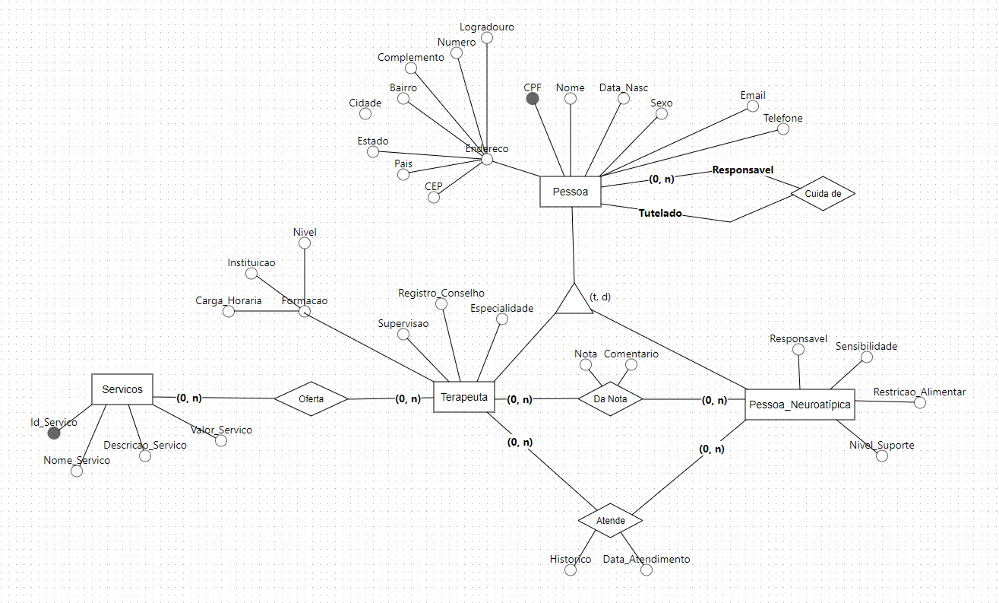
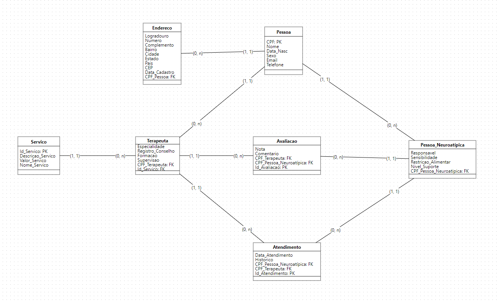
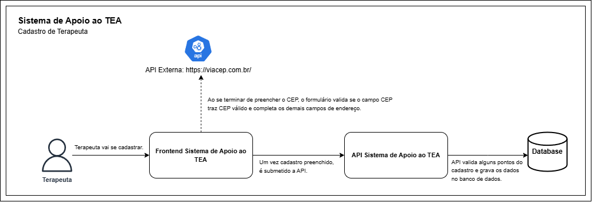

# Sistema de Apoio ao Autista

Sistema criado pra dar apoio às famílias e pessoas no espectro autista a localizar serviços e profissionais próximos de si, bem como, no futuro, incluirá uma gama de variedades de ferramentas para suporte, amparo e apoio ao autista.

O foco inicial de busca é por AT (Assistente Terapêutico), tendo em vista a necessidade constante de autista em todos os níveis e falta de suporte de planos de saúde e clínicas particulares  para atender a estas demandas profissionais, tendo em vista que não há uma regulmentação rígida sobre quem pode exercer esta função, nem mesmo que tipo de formação, resultando em menos profissionais no mercado.

Este projeto está em fase inicial, possui apenas um cadastro para terapeutas e uma interface para busca dos profissionais por estado.

No futuro, permitirá agendamento de consultas, pagamento online, registro de histórico do autista para compartilhamento (com autorização) com os profissionais multidisciplinares que atenderão a pessoa no espectro austista.

O sistema também visa, no futuro, funcionar como uma carteira de regisros da pessoas no espectro autista, para que seja possível lhe facilitar o acesso aos benefícios destinados a este grupo, tudo concentrado em um só lugar.

Também se prevê, que o assistente terapêutico e demais profissionais possam ser avaliados, bem como registrem seu histórico profissional e atualizações.

Especificamente para assistentes terapêuticos, devido a falta de regulamentação rígida, o sistema só permitirá cadastro dos mesmos desde que possuam pelo menos 80h de treinamentos voltado para o conhecimento do espectro autista, sendo validado nos respectivos locais amplamente conhecidos como centro de formação para profissionais que atuam com autistas.

O sistema prevê também, no futuro, incluir neuroatípicos em geral.

Link para o frontend: https://github.com/robertsonazevedo/sistema-apoio-tea-front

### 📋 Esquema de banco de dados previsto para aplicação

* Esquema de banco de dados conceitual


* Esquema de banco de dados físico



### 📋 Arquitetura do Sistema



### 📋 Pré-requisitos

- Python3
- Recomendamos utilizar o venv, que é um ambiente virtualizado para executar aplicações Python. Mais informações aqui: https://docs.python.org/3/library/venv.html
- A instalação do venv é opcional, você poderá executar diretamente em sua máquina também.
- Se for usar container Docker, você precisará ter o Docker instalado em sua máquina.

Exemplo de uso do ambiente virtual "venv" no Linux (É necessário estar na raiz do projeto).

Comando para instalação do venv, após ter o Python instado:
```
python -m venv venv
```

Em seguida, você precisará ativar o venv com o seguinte comando:
```
source venv/bin/activate
```
Se após o comando acima, aparecer antes da linha de digitação no terminal a palavra venv (entre parenteses), a ativação foi feita com sucesso.
```
(venv)/home/robertson/code/sistema-apoio-tea-api
```
Quando terminar de usar, basta dar o comando "deactivate" para encerrar o terminal venv.
```
deactivate
```

Para instruções de como ativar o venv no Windows, seguir a documentação: https://docs.python.org/3/library/venv.html

### 🔧 Instalação

Para testar o programa, você precisará subir a API, que foi feita em Python, para isto será necessário instalar o Python em sua máquina:

Debian, Ubuntu e distros baseadas nos mesmos:

```
sudo apt-get install python3.10
```

RedHat, CentOs e distros baseadas nos mesmos:   

```
sudo yum install python3.10
```
Para instalação no Windows, basta seguir os passos na documentação oficial do Python.
```
https://python.org.br/instalacao-windows/
```
Uma vez com o Python3 instalado, execute o comando abaixo para instalar as bibliotecas necessárias para o sistema rodar:
```
pip install -r requirements.txt
```
Para subir o programa, execute o comando abaixo:
```
flask run --host 0.0.0.0 --port 5000
```
Caso queira usar o modo de desenvolvimento, ao subir a API, digite o mesmo comando acima, mas com a opção --reload, pois isto lhe permitirá ver as alterações que você fizer a cada vez que o código for salvo:
```
flask run --host 0.0.0.0 --port 5000 --reload
```
Por fim, para começar a testar a API, abra o navegador no endereço abaixo:
```
http://localhost:5000/#/
```
Se tudo seguir como esperado, no navegador terá a tela inicial com a documentação da API, neste caso vamos usar o Swagger para testes, escolha esta opção no navegador.

### 🔧 Execução da API com container Docker

Caso não queira fazer todo processo de instalação em sua máquina, você poderá subir a API em docker, é bem simples e basta ter o docker instalado em sua máquina. Uma vez o docker instalado em sua máquina, basta seguir os passos abaixo:

Buildar a Imagem (Lembre-se de estar na raiz do projeto, no mesmo diretório onde está o arquivo Dockerfile):
```
docker build -t api-sistema-apoio-tea .
```

Executando a API com base na imagem criada acima (Neste comando, estamos persistindo os dados do banco localmente.):
```
docker run -p 5000:5000 -v $(pwd)/database:/app/database api-sistema-apoio-tea
```

Por fim, para começar a testar a API, abra o navegador no endereço abaixo:
```
http://localhost:5000/#/
```


## ⚙️ Executando os testes

Para testar o sistema em seu navegador de forma completa (front e backend), você precisará baixar o repositório do Github do front do sistema-apoio-tea-front, no link: https://github.com/robertsonazevedo/sistema-apoio-tea-front .
Após, basta seguir as instruções de execução do front no Readme do mesmo.

### 📋 Melhorias Futuras

- Permitir médicos, psicólogos e terapeutas ocupacionais se cadastrarem.
- Permitir Terapeutas registrarem históricos.
- Consultar a formação dos profissionais nos órgãos e instituições de formação via chamada de API.
- Pagamento pela plataforma junto com o agendamento.
- Localização do autista via gps.
- Permitir contratante avaliar terapeuta.

## 🛠️ Construído com

* [Python](https://docs.python.org/3/) - A linguagem de programação.
* [Flask](https://flask-ptbr.readthedocs.io/en/latest/) - Framework de Desenvolvimento.
* [SQLite](https://www.sqlite.org/) - Enginte de banco de dados para testes conceituais.
* [Pydantic](https://docs.pydantic.dev/latest/) - Biblioteca importante para validação de dados.


## 📌 Versão

Nós usamos [SemVer](http://semver.org/) para controle de versão. Para as versões disponíveis, observe as [tags neste repositório](https://github.com/suas/tags/do/projeto). 

## ✒️ Autores


* **Robertson Azevedo** - *Trabalho Inicial e Documentação* - [robertsonazevedo](https://github.com/robertsonazevedo)
E-mail: azevedo.robertson@gmail.com / contato@techrobertson.com


## 📄 Licença

Este projeto está sob a licença (sua licença) - veja o arquivo [LICENSE.md](https://github.com/usuario/projeto/licenca) para detalhes.

## 🎁 Expressões de gratidão

* Agradecimento ao meu filho Noah, por me inspirar a seguir em frente 📢;


---
⌨️ com ❤️ por [Robertson Azevedo](https://github.com/robertsonazevedo) 😊
